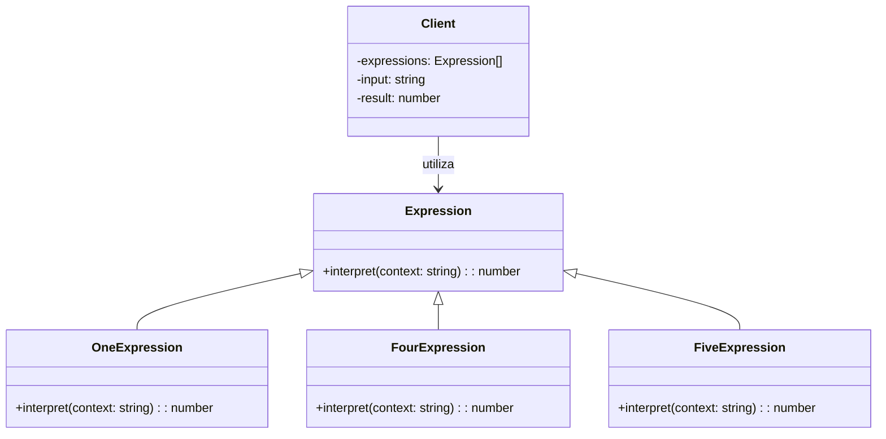

# Interpreter

## Intenção  
Dado uma linguagem, define uma representação para sua gramática junto com um interpretador que usa essa representação para interpretar sentenças dessa linguagem.

## Também conhecido como  
- Interpretador de gramática  
- Analisador de linguagem  


## Motivação  

Imagine que você precise interpretar números romanos como `"III"` ou `"IV"` e convertê-los para números decimais.  

Você poderia fazer isso com `if` e `switch`, mas essa abordagem se torna difícil de manter à medida que a gramática cresce.

O código a seguir representa um cenário sem utilização do interpreter, onde é possível notar violação do princípio Aberto/Fechado e a dificuldade de testar e ampliar o código:

```ts
function interpretarNumeroRomano(entrada: string): number {
  if (entrada === "I") return 1;
  else if (entrada === "II") return 2;
  else if (entrada === "III") return 3;
  else if (entrada === "IV") return 4;
  else if (entrada === "V") return 5;
  else if (entrada === "VI") return 6;
  else if (entrada === "VII") return 7;
  else if (entrada === "VIII") return 8;
  else if (entrada === "IX") return 9;
  else if (entrada === "X") return 10;
  else return 0; // inválido
}

// Uso
console.log(interpretarNumeroRomano("IV")); // 4
```

> 💡
> Com o padrão **Interpreter**, você cria uma classe para cada símbolo (`I`, `V`, `X`...) e define como eles são interpretados. Isso torna o sistema mais **modular**, **reutilizável** e **fácil de estender**.


## Aplicabilidade

Use o padrão **Interpreter** quando:

- A gramática do problema puder ser modelada como uma linguagem.
- Você quiser criar interpretadores reutilizáveis para expressões simples.
- A linguagem tem regras simples e bem definidas.

## UML




## Exemplo Aplicado — Interpretador de Números Romanos

```ts
// Interface da expressão
interface Expression {
  interpret(context: string): number;
}

// Expressões terminais
class OneExpression implements Expression {
  interpret(context: string): number {
    return context === "I" ? 1 : 0;
  }
}

class FourExpression implements Expression {
  interpret(context: string): number {
    return context === "IV" ? 4 : 0;
  }
}

class FiveExpression implements Expression {
  interpret(context: string): number {
    return context === "V" ? 5 : 0;
  }
}

// Cliente
const expressions: Expression[] = [
  new OneExpression(),
  new FourExpression(),
  new FiveExpression()
];

const input = "IV";
let result = 0;

for (const expr of expressions) {
  result = expr.interpret(input);
  if (result > 0) break;
}

console.log(`Resultado: ${result}`); // Resultado: 4
```


## Estrutura GOF


## Participantes

- **AbstractExpression (`Expression`)**  
  Interface comum para todas as expressões.

- **TerminalExpression (`OneExpression`, `FourExpression`, etc.)**  
  Implementa a interpretação de símbolos terminais da linguagem.

- **Context (a string de entrada)**  
  Contém o texto a ser interpretado.

- **Client**  
  Constrói e usa a árvore de expressões para interpretar a entrada.


## Colaborações

- O cliente instancia expressões e as organiza em uma árvore (ou lista).
- A interpretação ocorre em cada expressão, que processa o contexto de entrada.


## Consequências

### Benefícios

- Modulariza regras da linguagem.
- Fácil de estender com novas expressões.
- Boa para DSLs e pequenos interpretadores.

### Desvantagens

- Pode gerar muitas classes.
- Não é eficiente para gramáticas complexas.


## Implementação

1. **Crie a interface `Expression`** com o método `interpret`.
2. **Implemente expressões terminais** para cada símbolo.
3. **Monte a lista ou árvore de expressões** no cliente.
4. **Interprete o contexto** chamando `interpret` em cada expressão.


## Padrões Relacionados

- **Composite**: Para compor expressões complexas.
- **Visitor**: Para adicionar novas operações sem alterar as expressões.


## Conclusão

O padrão **Interpreter** é ideal para interpretar linguagens simples, como comandos, expressões matemáticas ou linguagens específicas de domínio (DSLs).  
É uma solução limpa e extensível, desde que a gramática não seja grande demais.


## Referências

- GAMMA, Erich et al. *Padrões de Projeto: Soluções Reutilizáveis de Software Orientado a Objetos*. Bookman, 2007.  
- Refactoring Guru – [Interpreter Pattern](https://refactoring.guru/design-patterns/interpreter)  
- SHVETS, Alexandre. *Dive Into Design Patterns*, 2021.
