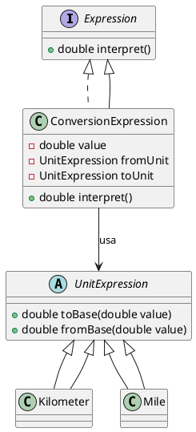
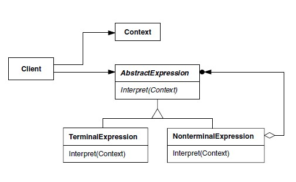

# Interpreter

## Intenção  
Dado uma linguagem, define uma representação para sua gramática junto com um interpretador que usa essa representação para interpretar sentenças dessa linguagem.

## Também conhecido como  
- Interpretador de gramática  
- Analisador de linguagem  

---

## Motivação  

Imagine um sistema que precisa entender e interpretar comandos como:

- "10 km to miles"  
- "5 kg to lb"  
- "100 celsius to fahrenheit"

Essas frases representam uma linguagem simples com estrutura: **valor + unidade origem + “to” + unidade destino**.

> Com o padrão **Interpreter**, cada unidade é uma expressão terminal e a lógica de conversão é modularizada, facilitando manutenção e expansão.

---

## Aplicabilidade

Use o padrão **Interpreter** quando:

- A linguagem do problema pode ser expressa em uma gramática simples.
- A estrutura da linguagem muda pouco mas as expressões podem crescer.
- Você deseja montar um interpretador modular, reutilizável e extensível.

---

## PlantUML — Diagrama de Classes

---

## Exemplo Aplicado — Conversor de Unidades (Java)

@import "src/interpreter/Expression.java"

@import "src/interpreter/UnitExpression.java"

@import "src/interpreter/Kilometer.java"

@import "src/interpreter/Mile.java"

@import "src/interpreter/ConversionExpression.java"

### Exemplo de uso:
@import "src/interpreter/Main.java"

---

## Estrutura GOF

## Participantes

- **AbstractExpression (`Expression`)**  
  Interface comum para todas as expressões.

- **TerminalExpression (`Kilometer`, `Mile`, etc.)**  
  Implementa a interpretação de unidades específicas da linguagem.

- **NonTerminalExpression (`ConversionExpression`)**  
  Composição de expressões para representar a conversão entre unidades.

- **Context (a string de entrada)**  
  Contém o texto a ser interpretado, por exemplo: "10 km to miles".

- **Client**  
  Constrói as expressões e executa a interpretação com base na entrada.

---

## Colaborações

- O cliente converte a entrada de texto em instâncias de expressões.
- Cada unidade sabe converter para/de unidade base.
- A conversão ocorre via `interpret()`.

---

## Consequências

### Benefícios

- Modularidade e separação clara entre lógica de unidades.
- Fácil de adicionar novas unidades (ex: temperatura, peso).
- Código extensível e de fácil manutenção.

### Desvantagens

- Pode criar muitas classes para unidades.
- Parsing de entrada pode exigir um parser mais robusto.

---

## Implementação

1. Crie a interface `Expression`.
2. Crie classes para unidades (`UnitExpression`).
3. Implemente `ConversionExpression` para combinar valor e unidades.
4. Faça parsing no cliente e use `interpret()`.

---

## Padrões Relacionados

- **Composite**: Para montar expressões mais complexas.
- **Factory Method**: Para criar expressões a partir de texto.
- **Strategy**: Para substituir lógica de conversão por algoritmos configuráveis.

---

## Conclusão

O padrão **Interpreter** se encaixa perfeitamente em sistemas que precisam interpretar linguagens simples, como sentenças de conversão de unidades.  
Permite construção modular, crescimento da linguagem e manutenção