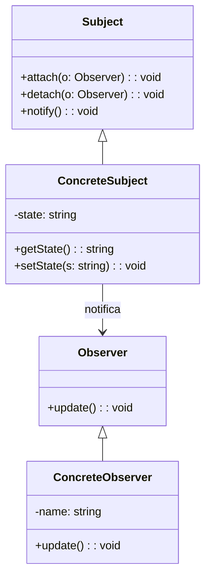
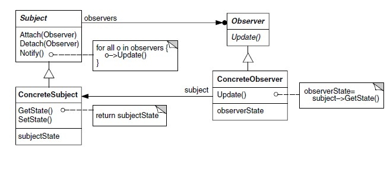

# Observer

## Intenção  
Define uma dependência um-para-muitos entre objetos, de forma que quando um objeto muda de estado, todos os seus dependentes são notificados e atualizados automaticamente.

## Também conhecido como  
- Dependência de publicação-assinatura  
- Listener  


## Motivação  

Imagine um sistema onde várias partes da aplicação precisam ser notificadas sempre que um determinado dado for alterado — como uma interface gráfica que precisa se atualizar automaticamente ao receber uma nova mensagem.  

Você poderia fazer isso chamando manualmente cada função envolvida, mas isso criaria um acoplamento direto entre os componentes e dificultaria a manutenção.

O código a seguir mostra um cenário sem o padrão Observer, onde o objeto sujeito precisa conhecer e chamar explicitamente cada observador:

```ts
class Sistema {
  private status: string = "";

  atualizarTela() {
    console.log("Tela atualizada: " + this.status);
  }

  enviarEmail() {
    console.log("Email enviado: " + this.status);
  }

  alterarStatus(novoStatus: string) {
    this.status = novoStatus;
    this.atualizarTela();
    this.enviarEmail();
  }
}

const sistema = new Sistema();
sistema.alterarStatus("Pedido confirmado");
```

> 💡   Com o padrão **Observer**, os observadores se inscrevem no sujeito, e o sujeito **não precisa saber quem são** nem o que fazem. Isso torna o sistema mais **flexível**, **desacoplado** e **fácil de manter**.


## Aplicabilidade

Use o padrão **Observer** quando:

- Uma alteração em um objeto requer atualização de outros objetos.
- Você quer evitar acoplamento direto entre o sujeito e seus observadores.
- Um sistema precisa reagir a eventos de forma distribuída.


## UML




## Exemplo Aplicado — Notificador de Estado

```ts
// Interfaces
interface Observer {
  update(message: string): void;
}

interface Subject {
  attach(observer: Observer): void;
  detach(observer: Observer): void;
  notify(): void;
}

// Sujeito concreto
class StatusNotifier implements Subject {
  private observers: Observer[] = [];
  private message: string = "";

  attach(observer: Observer): void {
    this.observers.push(observer);
  }

  detach(observer: Observer): void {
    this.observers = this.observers.filter(o => o !== observer);
  }

  setMessage(msg: string): void {
    this.message = msg;
    this.notify();
  }

  notify(): void {
    for (const observer of this.observers) {
      observer.update(this.message);
    }
  }
}

// Observadores
class EmailService implements Observer {
  update(message: string): void {
    console.log("Enviando e-mail: " + message);
  }
}

class UIUpdater implements Observer {
  update(message: string): void {
    console.log("Atualizando interface: " + message);
  }
}

// Uso
const notifier = new StatusNotifier();
notifier.attach(new EmailService());
notifier.attach(new UIUpdater());

notifier.setMessage("Pedido confirmado");
```


## Estrutura GOF




## Participantes

- **Subject**  
  Interface para adicionar, remover e notificar observadores.

- **ConcreteSubject**  
  Armazena o estado e notifica os observadores quando ele muda.

- **Observer**  
  Interface que define o método `update()`.

- **ConcreteObserver**  
  Implementa `update()` e reage às mudanças no sujeito.


## Colaborações

- O **Subject** mantém a lista de **Observers** e notifica todos quando seu estado muda.
- Os **Observers** reagem conforme sua própria lógica, sem o Subject saber o que eles fazem.


## Consequências

### Benefícios

- Desacoplamento entre sujeito e observadores.
- Facilidade para adicionar novos observadores em tempo de execução.
- Observadores podem ser reutilizados em diferentes contextos.

### Desvantagens

- Pode haver notificações em cascata inesperadas.
- Não há controle da ordem de notificação dos observadores.


## Implementação

1. Defina interfaces `Observer` e `Subject`.
2. Crie o `ConcreteSubject` com o estado monitorado e a lista de observadores.
3. Implemente `ConcreteObservers` com a lógica de reação.
4. Faça o registro e notificação conforme mudanças de estado.


## Padrões Relacionados

- **Mediator**: Pode encapsular a notificação central.
- **Event Bus / Publisher-Subscriber**: Abstrações mais flexíveis do mesmo conceito.


## Conclusão

O padrão **Observer** é ideal quando várias partes da aplicação precisam reagir a mudanças de estado de forma desacoplada.  
É muito usado em interfaces gráficas, eventos de sistemas e comunicação assíncrona entre componentes.


## Referências

- GAMMA, Erich et al. *Padrões de Projeto: Soluções Reutilizáveis de Software Orientado a Objetos*. Bookman, 2007.  
- Refactoring Guru – [Observer Pattern](https://refactoring.guru/design-patterns/observer)  
- SHVETS, Alexandre. *Dive Into Design Patterns*, 2021.
